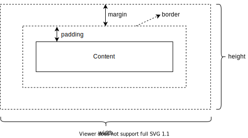

# CSS

CSS is used to style HTML elements. It consists of:

1. selector
2. property
3. value

```css
/*
paragraph styling
*/
p, div {
  font-family: Avenir, Helvetica, Arial, sans-serif;
  -webkit-font-smoothing: antialiased;
  -moz-osx-font-smoothing: grayscale;
  text-align: center;
  color: #2c3e50;
  margin-top: 60px;
}
```

The syntax is:

1. `/* ... */`: for comment
2. `,`: separates diferent selectors
3. `{}`: wraps all properties
4. `;` separates different properties

## Selector

Selector is used to target which element needs to style. There are many ways to specify the corresponding elements.

: \(#tab:selector) Common Selectors

| Selector        | Example             | Element                                                                |
| --------------- | ------------------- | ---------------------------------------------------------------------- |
| Univeral        | `*`                 | -                                                                      |
| Element         | `p`                 | `<p>`                                                                  |
| ID              | `#my-id`            | `<p id="my-id">...</p>`                                                |
| Class           | `.my-class`         | `<p class="my-class">...</p>`                                          |
| Attribute       | `img[src="my.png"]` | `img[src="my.png"]`                                                    |
| Pseudo Class    | `a:hover`           | -                                                                      |
| Pseudo Element  | `::first-line`      | -                                                                      |
| Direct Children | `div > p`           | -                                                                      |
| Descendent      | `div p`             | -                                                                      |
| Ajacent Sibling | `h1 + p`            | `<h1></h1><p></p>` `<p>` is direct ajacent to `<h1>`                   |
| General Sibling | `h1 ~ p`            | `<h1></h1><h2></h2><p></p>` `<p>` is ajacent, but not direct to `<h1>` |

Selectors can have different *specificity*, the higher one will have more priority. From low to high is:

1. element selector: `0-0-1`
2. Class selector: `0-1-0`
3. ID selector: `1-0-0`

These values can be added. Attributes value with `!important` has the highest priority.

## Box Model

```{r, echo = FALSE, fig.align = 'center', fig.cap = "Box Model"}

```

Every element is rendered according to box model. The `display` property controls box style.

1. block
    1. the box will break onto a new line
    2. the box will extend fill the space available
    3. the width and height properties will apply
    4. padding, margin and border will cause other elements to be pushed away from the box
2. inline
    1. the box will not break onto a new line
    2. the width and height properties will not apply
    3. vertical padding, margins and borders will apply, but not cause other inline boxes to move away
    4. horizontal padding, margins and borders will apply, cause other inline boxes to move
3. inline-block
    1. the box will not break onto a new line
    2. the width and height properties will apply
    3. padding, margin and border will cause other elements to be pushed away

Box properties:

1. `box-sizing: [content-box, border-box]`
2. `width min-width max-width`
3. `height min-height max-height`
6. `margin: 20px`
7. `border: 1px solid red`: short for `{border-width: 1px; border-style: solid; border-color: red}`
    1. `border-width: 1px`
    2. `border-style: [none, solid, dotted, dashed, double]`
    3. `border-color: red`
    4. `border-radius: [10px, 20%]`
8. `padding: 10px`
9.  `line-height`
10. `overflow: [visible, hidden scroll, auto]`
11. `float: [left, right, both, none]`
12. `position: [static, relative, absolute, fixed, sticky]`
13. `z-index`

## Unit

1. Absolute
    1. `in`: 2.54cm
    2. `px`: 1/96 `in`
    3. `pt`: 1/72 `in`
2. relative
    1. `%`
    2. `em`: font size of the parent
    3. `rem`: font size of the root element `<html>`)
    4. `vw`: viewport width, `1vw` is `1%` of the viewport width
    5. `vh`: viewport height


## Font

```{r, echo=FALSE, fig.align="center", fig.cap="line height"}
knitr::include_graphics("images/line-height.drawio.svg")
```

Properties:

1. `font-family`
    1. sans-serif: `[Helvetica, Arial, Verdana]`
    2. serif: `[Georgia, "Times New Roman"]`
    3. monospace: `["Courier New"]`
2. `line-height: [20px, 1.2, 120%, 2em]`
3. `font-size: 10px`: inherits from parent element
4. `color: red`
5. `font-style: [normal, italic, oblique]`
6. `font-weight: [normal, bold(700), lighter, bolder, 100-900]`
7. `text-decoration: [none, overline, underline,line-through]`
    1. `text-decoration-line: [underline, line-through, overline,none]`
    2. `text-decoration-style:[solid, dotted, dashed, double,wavy]`
8.  `font-variant: [normal, small-caps]`
9.  `texttransform: [none, uppercase, lowercase, capitalize, full-width]`
10. `text-shadow: 5px 10px 2px red`
11. `text-align: [left, right, center, justify]`
12. `vertical-align: [baseline, sub, super, text-top, text-bottom, top, middle, bottom, percentage, length]`
13. `text-indent`
14. `letter-spacing: 1px`
15. `word-spacing`
16. `::first-line`
17. `::first-letter`
18. `::selection`: text highlighted by the cursor

## Color

Color settings:

1. kewwords: `[red, green, blue ...]`
2. hexademical RGB: `#ff0000`
3. RGB and RGBA: `rgb(255, 255, 255); rgba(255, 255, 255, 0.2)`
4. HSL and HSLA: `hsl(188, 80%, 90%)`

## Background

Background properties:

1. `background`
2. `background-color: rgba(255, 255, 255, 0.2)`
3. `background-image: url(star.png)`
4. `backgrond-repeat: [no-repeat, repeat-x, repeat-y, repeat]`
5. `background-size: [ 100px 10em, cover, contain]`
6. `background-position: [20px 10%, top center, top 20px right 10px]`
7. `background-attachment`

## Elements

### Hyperlink {-}

`<a></a>` have different pseudo classes for different status:

1. `:link`: unvisited
1. `:visited`: exists in the browser's history
1. `:focus`: using Tab key or HTMLElement.focus()
1. `:hover`
1. `:active`: when being activated or clicked

### List {-}

Properties:

1. `list-style`: shorthand `list-style-type`, `list-style-position`
2. `list-style-type:`
    1. `none`
    2. `disc`
    3. `circle`
    4. `square`
    5. `decimal`
    6. `decimal-leading-zero`
    7. `lower-roman`
    8. `upper-roman`
    9. `lower-greek`
3.  `list-style-position: [outside, inside]`
4.  `list-style-image: url(ball.svg)`: `background-image` is better choice
5.  `:last-child`
